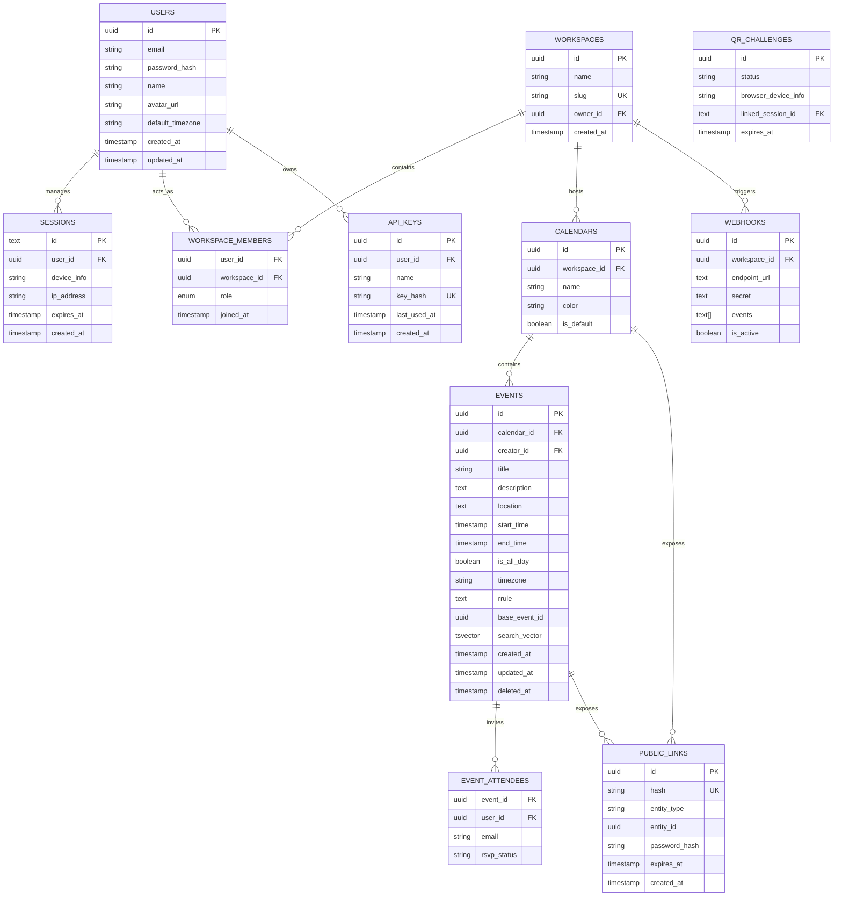

# 🗄️ 🗄️ Database Schema — Drizzle ORM, ERD & Indexing Strategy

# 🗄️ NovaCal — Database Schema & Entity Relationships

> **Engine:** PostgreSQL 16 **ORM:** Drizzle ORM (strict TypeScript definitions) **Philosophy:** Mathematically pristine. UTC-only storage. Soft deletes for offline sync. GIN-indexed FTS. RLS-ready foreign keys.


---

## 🗺️ Entity-Relationship Diagram (ERD)




---

## 💾 Drizzle ORM Schema Definitions

All tables live in `packages/db/schema/` and are exported from `packages/db/schema/index.ts`.


---

### 1. Core Identity & Authentication

No bloated third-party auth. Pure self-hosted identity with Better Auth.

```typescript
// packages/db/schema/auth.ts

import { pgTable, text, timestamp, uuid, varchar } from "drizzle-orm/pg-core";

// ─── Users ───
export const users = pgTable("users", {
  id: uuid("id").primaryKey().defaultRandom(),
  email: varchar("email", { length: 255 }).notNull().unique(),
  name: varchar("name", { length: 255 }).notNull(),
  passwordHash: text("password_hash"), // Nullable if using Magic Links later
  avatarUrl: text("avatar_url"),
  defaultTimezone: varchar("default_timezone", { length: 50 }).default("UTC").notNull(),
  createdAt: timestamp("created_at").defaultNow().notNull(),
  updatedAt: timestamp("updated_at").defaultNow().notNull(),
});

// ─── Device Ledger & Active Sessions ───
export const sessions = pgTable("sessions", {
  id: text("id").primaryKey(), // Better Auth uses text tokens
  userId: uuid("user_id").notNull().references(() => users.id, { onDelete: "cascade" }),
  deviceInfo: text("device_info"), // e.g., "Chrome on macOS" or "NovaCal Android"
  ipAddress: varchar("ip_address", { length: 45 }),
  expiresAt: timestamp("expires_at").notNull(),
  createdAt: timestamp("created_at").defaultNow().notNull(),
});

// ─── QR Auth Bridge Ledger ───
export const qrChallenges = pgTable("qr_challenges", {
  id: uuid("id").primaryKey().defaultRandom(),
  status: varchar("status", { length: 20 }).notNull().default("PENDING"), // PENDING | APPROVED | EXPIRED
  browserDeviceInfo: text("browser_device_info"),
  linkedSessionId: text("linked_session_id").references(() => sessions.id, { onDelete: "set null" }),
  expiresAt: timestamp("expires_at").notNull(), // Strictly 60 seconds from creation
});
```

**Key design decisions:**

* `passwordHash` is nullable — allows future Magic Link / passwordless flow without schema migration
* Sessions use text PK (Better Auth convention), cascade delete on user deletion
* `qrChallenges` has a `linkedSessionId` — when approved, the QR challenge points to the session it created


---

### 2. Multi-Team Collaboration (RBAC)

Isolated data environments. A user only sees what their `workspace_members` role allows.

```typescript
// packages/db/schema/workspace.ts

import { pgTable, pgEnum, text, timestamp, uuid, varchar, primaryKey } from "drizzle-orm/pg-core";
import { users } from "./auth";
import { workspaces } from "./workspace";

// ─── Role Enum ───
export const roleEnum = pgEnum("workspace_role", [
  "OWNER",    // Full control, billing, delete workspace
  "ADMIN",    // Invite users, modify settings
  "EDITOR",   // Create, edit, delete events
  "VIEWER",   // Read-only full access
  "FREE_BUSY" // See only "Busy" blocks
]);

// ─── Workspaces ───
export const workspaces = pgTable("workspaces", {
  id: uuid("id").primaryKey().defaultRandom(),
  name: varchar("name", { length: 100 }).notNull(),
  slug: varchar("slug", { length: 50 }).notNull().unique(),
  ownerId: uuid("owner_id").notNull().references(() => users.id, { onDelete: "restrict" }),
  defaultTimezone: varchar("default_timezone", { length: 50 }).default("UTC").notNull(),
  createdAt: timestamp("created_at").defaultNow().notNull(),
});

// ─── Workspace Memberships ───
export const workspaceMembers = pgTable("workspace_members", {
  workspaceId: uuid("workspace_id").notNull().references(() => workspaces.id, { onDelete: "cascade" }),
  userId: uuid("user_id").notNull().references(() => users.id, { onDelete: "cascade" }),
  role: roleEnum("role").notNull().default("VIEWER"),
  joinedAt: timestamp("joined_at").defaultNow().notNull(),
}, (table) => ({
  pk: primaryKey({ columns: [table.workspaceId, table.userId] }) // Composite PK — no duplicate members
}));
```

| Constraint | Purpose |
|------------|---------|
| `ownerId` → `onDelete: "restrict"` | Cannot delete a user who owns workspaces. Must transfer ownership first. |
| Composite PK on `workspace_members` | Prevents a user from appearing twice in the same workspace |
| `slug` unique | Enables vanity URLs like `cal.domain.com/w/engineering` |


---

### 3. The Scheduling Engine (Calendars & Events)

Optimized for performance and offline-sync via the `deletedAt` tombstone.

```typescript
// packages/db/schema/calendar.ts

import { pgTable, text, timestamp, uuid, varchar, boolean, primaryKey } from "drizzle-orm/pg-core";
import { users } from "./auth";
import { workspaces } from "./workspace";

// ─── Calendars ───
export const calendars = pgTable("calendars", {
  id: uuid("id").primaryKey().defaultRandom(),
  workspaceId: uuid("workspace_id").notNull().references(() => workspaces.id, { onDelete: "cascade" }),
  name: varchar("name", { length: 100 }).notNull(),
  color: varchar("color", { length: 7 }).default("#6366F1").notNull(), // Hex codes
  isDefault: boolean("is_default").default(false).notNull(),
  createdAt: timestamp("created_at").defaultNow().notNull(),
});

// ─── Events ───
export const events = pgTable("events", {
  id: uuid("id").primaryKey().defaultRandom(),
  calendarId: uuid("calendar_id").notNull().references(() => calendars.id, { onDelete: "cascade" }),
  creatorId: uuid("creator_id").notNull().references(() => users.id),

  title: varchar("title", { length: 255 }).notNull(),
  description: text("description"),                 // Markdown only — no binary files
  location: text("location"),

  // Timestamps MUST be stored in UTC
  startTime: timestamp("start_time", { withTimezone: true }).notNull(),
  endTime: timestamp("end_time", { withTimezone: true }).notNull(),
  isAllDay: boolean("is_all_day").default(false).notNull(),

  // Timezone override (e.g., event booked while traveling)
  timezone: varchar("timezone", { length: 50 }),

  // Advanced Recurrence (RFC 5545 / RRule format)
  rrule: text("rrule"),
  baseEventId: uuid("base_event_id"),               // If this is a modified single-instance of a recurring series

  // Offline Sync & Audit
  createdAt: timestamp("created_at").defaultNow().notNull(),
  updatedAt: timestamp("updated_at").defaultNow().notNull(),
  deletedAt: timestamp("deleted_at"),                // Soft delete — critical for offline sync
});

// ─── Event Attendees ───
export const eventAttendees = pgTable("event_attendees", {
  eventId: uuid("event_id").notNull().references(() => events.id, { onDelete: "cascade" }),
  userId: uuid("user_id").references(() => users.id, { onDelete: "cascade" }),
  email: varchar("email", { length: 255 }),          // For external guests not in the database
  rsvpStatus: varchar("rsvp_status", { length: 20 }).default("PENDING"), // ACCEPTED | DECLINED | TENTATIVE
}, (table) => ({
  pk: primaryKey({ columns: [table.eventId, table.userId] })
}));
```

#### Timezone Rules

| Rule | Implementation |
|------|----------------|
| **Storage** | Always `timestamptz` (UTC-normalized) |
| **Display** | Rendered in user's local timezone via `Intl` or stored preference |
| **Override** | Event-level `timezone` field for cases like "Flight to New York (displayed in ET)" |
| **Conversion** | Never store local time. Apply timezone at render time only. |

#### Recurrence Model

```
Parent event: rrule = "FREQ=WEEKLY;BYDAY=MO", baseEventId = null
  → Child event (modified): rrule = null, baseEventId = parent.uuid
  → All other occurrences computed from parent's rrule at query time
```

When a user edits "This event only" on a recurring series:


1. `baseEventId` on the child points to the parent
2. The child has explicit `startTime`/`endTime` differing from the RRule expansion
3. Query engine: expand parent RRule → overlay any child overrides → return merged set


---

### 4. Developer API, MCP & Webhooks

Foundation for AI agents (Cursor/Claude) and enterprise integrations.

```typescript
// packages/db/schema/developer.ts

import { pgTable, text, timestamp, uuid, varchar, boolean } from "drizzle-orm/pg-core";
import { users } from "./auth";
import { workspaces } from "./workspace";

// ─── API Keys (for MCP + REST API access) ───
export const apiKeys = pgTable("api_keys", {
  id: uuid("id").primaryKey().defaultRandom(),
  userId: uuid("user_id").notNull().references(() => users.id, { onDelete: "cascade" }),
  name: varchar("name", { length: 100 }).notNull(), // e.g., "Cursor MCP Integration"
  keyHash: text("key_hash").notNull().unique(),      // bcrypt hash — never store raw
  lastUsedAt: timestamp("last_used_at"),
  createdAt: timestamp("created_at").defaultNow().notNull(),
});

// ─── Webhooks (for n8n/Zapier/external integrations) ───
export const webhooks = pgTable("webhooks", {
  id: uuid("id").primaryKey().defaultRandom(),
  workspaceId: uuid("workspace_id").notNull().references(() => workspaces.id, { onDelete: "cascade" }),
  endpointUrl: text("endpoint_url").notNull(),
  secret: text("secret").notNull(),                   // HMAC signing secret
  events: text("events").array().notNull(),           // e.g., ['event.created', 'event.deleted']
  isActive: boolean("is_active").default(true).notNull(),
  createdAt: timestamp("created_at").defaultNow().notNull(),
});
```


---

### 5. Public Sharing & Cryptographic Links

Handles the `/p/[hash]` and `/e/[hash]` functionality.

```typescript
// packages/db/schema/sharing.ts

import { pgTable, text, timestamp, uuid, varchar } from "drizzle-orm/pg-core";

export const publicLinks = pgTable("public_links", {
  id: uuid("id").primaryKey().defaultRandom(),
  hash: varchar("hash", { length: 64 }).notNull().unique(),
  entityType: varchar("entity_type", { length: 20 }).notNull(), // 'CALENDAR' | 'EVENT'
  entityId: uuid("entity_id").notNull(),                         // Polymorphic reference
  passwordHash: text("password_hash"),                           // Nullable = no password
  expiresAt: timestamp("expires_at"),
  createdAt: timestamp("created_at").defaultNow().notNull(),
});
```

**Polymorphic design:** `entityType` + `entityId` allows a single `public_links` table to serve both calendar views and individual event landing pages without separate tables.


---

## ⚡ The "Million-Dollar" Indexing Strategy (Raw SQL)

Drizzle handles the schema. True performance comes from custom PostgreSQL indexes. Run these via raw SQL migrations alongside Drizzle.

### 1. High-Speed Grid Queries (Composite B-Tree Index)

When the Web UI loads a Month view, it queries by `calendar_id` and a `start_time` / `end_time` range.

```sql
CREATE INDEX idx_events_time_range
ON events (calendar_id, start_time, end_time)
WHERE deleted_at IS NULL;
```

| Query | Index Used |
|-------|------------|
| `SELECT * FROM events WHERE calendar_id = $1 AND start_time >= $2 AND end_time <= $3` | ✅ `idx_events_time_range` |
| `SELECT * FROM events WHERE start_time >= $1 AND end_time <= $2` (cross-calendar) | Partial — B-Tree on `start_time` alone also applies |

### 2. Native Full-Text Search (GIN Index)

Eliminates the need for ElasticSearch. Combines title, description, and location into a generated `tsvector` column.

```sql
-- Add generated tsvector column
ALTER TABLE events ADD COLUMN search_vector tsvector
  GENERATED ALWAYS AS (
    setweight(to_tsvector('english', coalesce(title, '')), 'A') ||
    setweight(to_tsvector('english', coalesce(location, '')), 'B') ||
    setweight(to_tsvector('english', coalesce(description, '')), 'C')
  ) STORED;

-- GIN index for lightning-fast search
CREATE INDEX idx_events_search ON events USING GIN(search_vector);
```

| Weight | Field | Priority |
|--------|-------|----------|
| `A`    | Title | Highest — exact title matches rank first |
| `B`    | Location | Medium   |
| `C`    | Description | Lowest — long text, less specific |

**Query example:**

```sql
SELECT * FROM events
WHERE search_vector @@ to_tsquery('english', 'sprint & review')
ORDER BY ts_rank(search_vector, to_tsquery('english', 'sprint & review')) DESC;
```

### 3. Sync & Conflict Resolution (B-Tree on updated_at)

The mobile app syncs by requesting all changes since its last sync timestamp.

```sql
CREATE INDEX idx_events_sync ON events (updated_at)
WHERE deleted_at IS NOT NULL OR updated_at > NOW() - INTERVAL '30 days';
```


---

## 📱 Offline Sync Strategy

### The `deleted_at` Tombstone

```
User deletes event on Web UI while phone is offline
  → DB sets deleted_at = NOW() (soft delete, NOT a hard DELETE)
  → Phone reconnects, requests: "Give me everything updated since last Tuesday"
  → Server sends tombstone: { id, deletedAt: timestamp }
  → Phone's SQLite cache deletes the local record
```

| Column | Purpose |
|--------|---------|
| `createdAt` | Know when an event was first created |
| `updatedAt` | Track changes for sync requests |
| `deletedAt` | Soft delete — enables offline reconciliation |

### Sync Endpoint

```
GET /api/sync?since=2026-05-01T00:00:00Z
Response: {
  "events": [ /* full event objects — created, updated, or deleted */ ],
  "calendars": [ /* calendar changes */ ],
  "workspaceMembers": [ /* membership changes */ ]
}
```


---

## 📊 Table Inventory

| Table | Domain | Row Estimate | Key Index |
|-------|--------|--------------|-----------|
| `users` | Auth   | N users      | PK on `id`, UNIQUE on `email` |
| `sessions` | Auth   | 3× users     | PK on `id`, FK on `user_id` |
| `qr_challenges` | Auth   | High churn (60s TTL) | PK on `id` |
| `workspaces` | Collaboration | \~10–100     | PK on `id`, UNIQUE on `slug` |
| `workspace_members` | Collaboration | 5–50× workspaces | Composite PK `(workspaceId, userId)` |
| `calendars` | Scheduling | 2–5× workspaces | PK on `id`, FK on `workspace_id` |
| `events` | Scheduling | 10K–1M+      | `idx_events_time_range`, `idx_events_search`, `idx_events_sync` |
| `event_attendees` | Scheduling | 3–10× events | Composite PK `(eventId, userId)` |
| `api_keys` | Developer | 2–5× users   | PK on `id`, UNIQUE on `key_hash` |
| `webhooks` | Developer | 1–5× workspaces | PK on `id` |
| `public_links` | Sharing | < 1000       | PK on `id`, UNIQUE on `hash` |


---

## ✅ Schema Implementation Checklist

### Auth Tables

- [ ] `users` — email unique, password_hash nullable, default_timezone
- [ ] `sessions` — text PK, cascade delete on user
- [ ] `qr_challenges` — TTL-enforced, PENDING/APPROVED/EXPIRED status

### Workspace Tables

- [ ] `workspaces` — ownerId restrict-delete, slug unique, timezone default
- [ ] `workspace_members` — composite PK, role enum with 5 values
- [ ] `roleEnum` — OWNER, ADMIN, EDITOR, VIEWER, FREE_BUSY

### Event Tables

- [ ] `calendars` — color hex, is_default, cascade on workspace delete
- [ ] `events` — timestamptz for start/end, rrule + baseEventId for recurrence
- [ ] `deletedAt` column — soft delete for offline sync
- [ ] `event_attendees` — composite PK, email for external guests
- [ ] `timezone` column — IANA override per event

### Developer Tables

- [ ] `api_keys` — key_hash unique, last_used_at tracking
- [ ] `webhooks` — events text\[\] array, HMAC secret

### Sharing Tables

- [ ] `public_links` — hash unique 64 chars, polymorphic entityType + entityId
- [ ] password_hash nullable, expires_at for TTL
- [ ] Polymorphic design supports both calendar and event links

### Indexes (Raw SQL)

- [ ] `idx_events_time_range` — composite on (calendar_id, start_time, end_time) WHERE deleted_at IS NULL
- [ ] `search_vector` — generated tsvector with weighted fields (A/B/C)
- [ ] `idx_events_search` — GIN index on search_vector
- [ ] `idx_events_sync` — B-Tree on updated_at for offline sync pull
